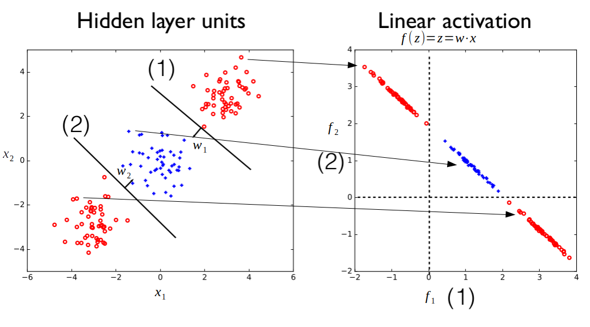
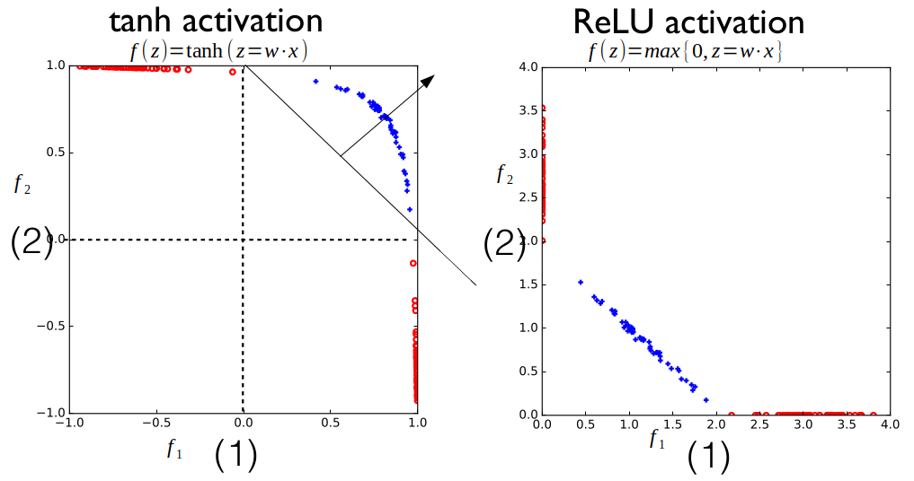

$\newcommand\array[1]{\begin{bmatrix}#1\end{bmatrix}}$ [[MITx 6.86x Notes Index]](https://github.com/sylvaticus/MITx_6.86x)

# Unit 03 - Neural networks

## Lecture 8. Introduction to Feedforward Neural Networks

### 8.1. Unit 3 Overview

This unit deals with Neural Networks, powerful tools that have many different usages as self-driving cars or playing chess.

Neural networks are really composed of very simple units that are akin to linear classification or regression methods.

We will consider:

- feed-forward neural networks (simpler)
- recurrent neural networks: can model sequences and map sequences to class labels
and even to other sequences (e.g. in machine translation)
- convolutional neural network: a specific architecture designed for processing images (used in the second part of project 2 for image classification)

At the end of this **unit**, you will be able to

- Implement a feedforward neural networks from scratch to perform image classification task.
- Write down the gradient of the loss function with respect to the weight parameters using back-propagation algorithm and use SGD to train neural networks.
- Understand that Recurrent Neural Networks (RNNs) and long short-term memory (LSTM) can be applied in modeling and generating sequences.
- Implement a Convolutional neural networks (CNNs) with machine learning packages.

### 8.2. Objectives

At the end of this **lecture**, you will be able to

-   Recognize different layers in a feedforward neural network and the number of units in each layer.
-   Write down common activation functions such as the hyperbolic tangent function tanh, and the rectified linear function (ReLU) .
- Compute the output of a simple neural network possibly with hidden layers given the weights and activation functions .
- Determine whether data after transformation by some layers is linearly separable, draw decision boundaries given by the weight vectors and use them to help understand the behavior of the network.

### 8.3. Motivation

The topic of feedforward neural networks is split into two parts:
- part one (this lesson): the model
  - motivations (what they bring beyond non-linear classification methods we have already seen);
  - what they are, and what they can capture;
  - the power of hidden layers.
- part two (next lesson):  learning from data: how to use simple stochastic gradient descent algorithms as a successful way of actually learning these complicated models from data.

#### Neural networks vs Non-linear classification methods we saw already

Let's consider a linear classifier $\hat y = sign(\mathbf{\theta} \cdot \phi(\mathbf{x}))$.

We can interpret the various dimensions of the original feature vector $\mathbf{x} \in \mathbb{R}^d$ as $d$ nodes. Then these nodes are mapped (non necessairly in a linear way) to $D$ nodes of the feature representation of $\phi(\mathbf{x} \in \mathbb{R}^D). Finally we take a linear combination of these nodes (dimensions), we apply our sign function and we obtain the classification.

The key difference between neural networks and the methods we saw in unit 2 is that, there, the mapping from $x$ to $\phi(x)$ in not part of the data analysis, it is done ex-ante (even, although implicitly, with the choice of a particular kernel), and then we optimise once we chose $\phi$.

In neural network instead the choice of the $\phi$ mapping is endogenous to the learning step, together with the choice of $\theta$.

Note that we have a bit of a chicken and egg problem here, as, in order to do a good classification - understand and learn the parameters theta for the classification decision - we would need to know what that feature representation is.

but on the other hand, in order to understand what a good feature representation would be, we would need to know how that feature representation is exercised in the ultimate classification task.

So we need to learn $\phi$ and $\theta$ jointly, trying to adjust the feature representation together with how it is exercised towards the classification task.

Motivation to Neural Networks (an other summary):

So far, the ways we have performed non-linear classification involve either first mapping $x$ explicitly into some feature vectors $\phi(x)$, whose coordinates involve non-linear functions of $x$, or in order to increase computational efficiency, rewriting the decision rule in terms of a chosen kernel, i.e. the dot product of feature vectors, and then using the training data to learn a transformed classification parameter.

However, in both cases, the feature vectors are chosen. They are not learned in order to improve performance of the classification problem at hand.

Neural networks, on the other hand, are models in which the feature representation is learned jointly with the classifier to improve classification performance.

### 8.4. Neural Network Units

Real neurons:
- take a signal in input using dendroids that connect the neuron to ~ 10^3 _ 10^4 other neurons
- the signal potential increases in the neuron's body
- once a threshold is reached, the neuron in turn emits a signal that, through its  axon, reaches ~ 100 other neurons

Artificial neural networks:
- the parameter associated to each nodes of a layer (input coordinates) take the role of weights trying to mimic the strength of the connection that propagates to the cell body;
- the response of a cell is in terms of a nonlinear transformation of the aggregated, weighted inputs, resulting in a single real number.

A bit of terminology:

- The individual coordinates are known as **nodes** or **units**.
- The weights are denoted with $w$ instead of $\theta$ as we were used to.
- Each node's **aggregated input** is given by $z = \sum_{i=1}^d x_i w_i + w_0$ (or, in vector form, $z = \mathbf{x} \cdot \mathbf{w} + w_0$, with $z \in \mathbb{R}, \mathbf{x} \in \mathbb{R}^d, \mathbf{w} \in \mathbb{R}^d$)
- The output of the neuron is the result of a non-linear transformation of the aggregated input called **activation function** $f = f(z)$
- A **neural network unit** is a primitive neural network that consists of only the “input layer", and an output layer with only one output.

Common kind of activation functions:
- linear. Used typically at the very end, before measuring the loss of the predictor;
- relu ("rectified linear unit"): $f(z) = max\{0,z\}$
- tanh ("hyperbolic tangent"): it mimics the sine function but in a soft way: it is a sigmoid curve spanning from -1 (at $z = -\infty$) to +1 (at $z= +\infty$), with a value of 0 at $z=0$. Its smoothness property is useful since we have to propagate the training signal through the network in order to adjust all the parameters in the model. $tanh(z) = \frac{e^{z}-e^{-z}}{e^{z}+e^{-z}}=1-\frac{2}{e^{2z}+1}$. Note that $tanh(–z) = –tanh(z)$.

Our objective will be to learn the weights that make this node, in the context of the whole network, to then function appropriately, to behave well.

### 8.5. Introduction to Deep Neural Networks

#### Overall architecture

In **deep forward neural networks**, neural network units are arranged in **layers**, from the _input layer_, where each unit holds the input coordinate, through various _hidden layer_ transformations, until the actual _output_ of the model.
In this layerwise computation, each unit in a particular layer takes input from _all_ the preceding layer units. And it has its own parameters that are adjusted to perform the overall computation. So parameters are different even between different units of the same layer.
A deep (feedforward) neural network refers hence to a neural network that contains not only the input and output layers, but also hidden layers in between.

- **Width** (_of the layer_): number of units in that specific layer
- **Depth** (_of the architecture_): number of layers of the overall transformation before arriving to the final output

Deep neural networks

- loosely motivated by biological neurons, networks
- adjustable processing units (~ linear classifiers)
- **highly parallel** (important!), typically organized in layers
- deep = many transformations (layers) before output

For example the input could be an image, so the input vector is the individual pixel content, from which the first layer try to detect edges, then these are recombined into parts (in subsequent layers), objects and finally characterisation of a scene: edges -> simple parts-> parts -> objects -> scenes

One of the main advantages of deep neural networks is that in many cases, they can learn to extract very complex and sophisticated features from just the raw features presented to them as their input. For instance, in the context of image recognition, neural networks can extract the features that differentiate a cat from a dog based only on the raw pixel data presented to them from images.

The initial few layers of a neural networks typically capture the simpler and smaller features whereas the later layers use information from these low-level features to identify more complex and sophisticated features.

Note: it is interesting to note that a neural network can represent any given binary function.

#### Subject areas

Deep learning has overtaken a number of academic disciplines in just a few years:

- computer vision (e.g., image, scene analysis)
- natural language processing (e.g., machine translation)
- speech recognition
- computational biology, etc.

Key role in recent successes in corporate applications such as:

- self driving vehicles
- speech interfaces
- conversational agents, assistants (Alexa, Cortana, Siri, Google assistant,.. )
- superhuman game playing

Many more underway (to perform prediction and/or control):

- personalized/automated medicine
- chemistry, robotics, materials science, etc.

#### Deep learning ... why now?

1. Reason #1: lots of data
  - many significant problems can only be solved at scale
  - lots of data enable us to model very complex rich models solving more realistic tasks;
2. Reason #2: parallel kid computational resources (esp. GPUs, tensor processing units)
  - platforms/systems that support running deep (machine) learning algorithms at scale in parallel
3. Reason #3: large models are actually easier to train
  - contrary to small, rigid models, large, richer and flexible models can be successfully estimated even with simple gradient based learning algorithms like stochastic gradient descent.
4. Reason #4: flexible neural “lego pieces”
  - common representations, diversity of architectural choices
  - we can easily compose these models together to perform very interesting computations.In other words, they can serve as very flexible computational Lego pieces that can be adapted overall to perform a useful role as part of much larger, richer computational architectures.

#### 8.6. Hidden Layer Models

Let's now specifically consist a deep neural network consisting of the input layer $\mathbf{x}$, a single hidden layer $\mathbf{z}$ performing the aggregation $z_i = \sum_j x_j * w_{j,i} + w_{0,i}$ and using $tanh(\mathbf{z})$ as activation function $f$, and the output node with a linear activation function.

We can see each layer (one in thiscase) as a "box" that takes as input $\mathbf{x}$ and return output $\mathbf{f}$, mediated trough its weigths $\mathbf{W}$, and the output layer as those box taking $\mathbf{f}$ as input and returning the final output $f$, mediated trough its weigths $\mathbf{W^\prime}$

And we are going to try to understand how this computation changes as a function of $W$ and $W^\prime$.

What these hidden units are actually doing ? Since they are like linear classifiers, they take linear combination of the inputs, pass through that nonlinear function, we can also visualize them as if they were linear classifiers with norm equal to $\mathbf{w}$.

The difference is that instead of having a binary output (like in $sign(\mathbf{w} \cdot \mathbf{x})$) we have now $f(\mathbf{w} \cdot \mathbf{x})$. $f$ typically takes the form of $tanh(\mathbf{w} \cdot \mathbf{x})$ for the hidden layers that we will study, whose output range is (-1,+1). More the point is far from the boundary, more $tanh()$ move toward the extremes, with a speed that is proportional to the norm of $\mathbf{w}$.

If we have (as it is normally) multiple nodes per layer, we can thing on a series of linear classifiers on the same $depth_{i-1}$ space, each one identified by its norm $\mathbf{w}_1, \mathbf{w}_2, ..., \mathbf{w}_{depth_{i}}$.

#### 2-D Example

Let's consider as example a case in 2-D where we have a cloud of negative points (red) in the bottom-left and top-right corners and a cloud of positive points (blue) in the center, like in the following chart (left side):

 

Such problem is clearly non linearly separable.

The chart on the right depicts the same points in the space resulting from the application of the two classifiers, using just a linear activation, i.e. the dot product between $w$ and $x$.

The appearance that it draws exactly as a line derives from the fact that the two planes are parallel, but the general idea is that still we have a problem that is not separable.

However, when we use $tanh(x)$ as activation function we obtain the output as depicted in the following chart (left), where the problem now is clearly linearly separable.

This is really where the power of the hidden layer lies. It gives us a transformation of the input signal into a representation that makes the problem easier to solve.

Finally we can try the ReLU activation ($f(z) = max\{0,z\}$): in this case the output is not actually strictly linearly separable.

So this highlights the difficulty of learning these models. It's not always the case that the same non-linear
transformation casts them as linearly separable.

However if we flip the planes directions, both the tanh and the ReLU activation results in outputs that become linearly separable (for the ReLU, all positive points got mapped to the (0,0) point).

What if we chose the two planes as random (i.e. $\mathbf{w}_1$ and $\mathbf{w}_2$ are random) ? The resulting output would likely not be linearly separable.
However if we introduce redundancy, e.g. using 10 hidden units for an original two dimensional problem, the problem would likely become linearly separable even if these 10 planes are chosen at random.
Notice this is quite similar to the systematic expansion that we did earlier, in terms of polynomial features.

So introducing redundancy here is actually helpful.
And we'll see how this is helpful also when we are actually learning these hidden unit representations from data. Introducing redundancy will make the optimization problem that we have to solve easier.

#### Summary

-
- Units in neural networks are linear classifiers, just with different output non-linearity
- The units in feed-forward neural networks are arranged in layers (input, one or plus hidden, output)
- By learning the parameters associated with the hidden layer units, we learn how to represent examples (as hidden layer activations)
- The representations in neural networks are learned directly to facilitate the end-to-end task
- A simple classifier (output unit) suffices to solve complex classification tasks if it operates on the hidden layer representations

The outward layer is their prediction that we actually want. And the role of the hidden layers is really to adjust their transformation, adjust their computation in such a way that the output layer will have an easier task to solve the problem.

The next lecture will deal with actually learning these representations together with the final classifier.

## Lecture 9. Feedforward Neural Networks, Back Propagation, and Stochastic Gradient Descent (SGD)

## Lecture 10. Recurrent Neural Networks 1

## Lecture 11. Recurrent Neural Networks 2

## Homework 4

## Lecture 12. Convolutional Neural Networks

## Project 3: Digit recognition (Part 2)

[[MITx 6.86x Notes Index]](https://github.com/sylvaticus/MITx_6.86x)
